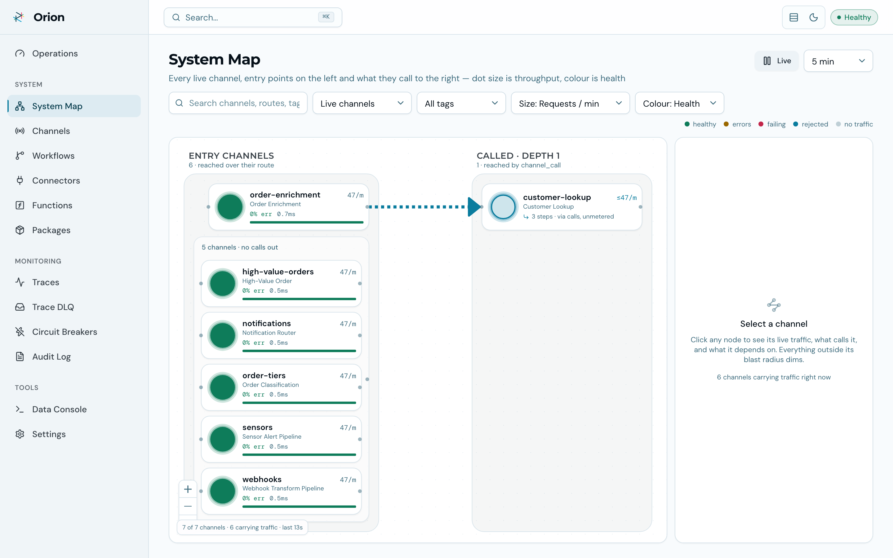
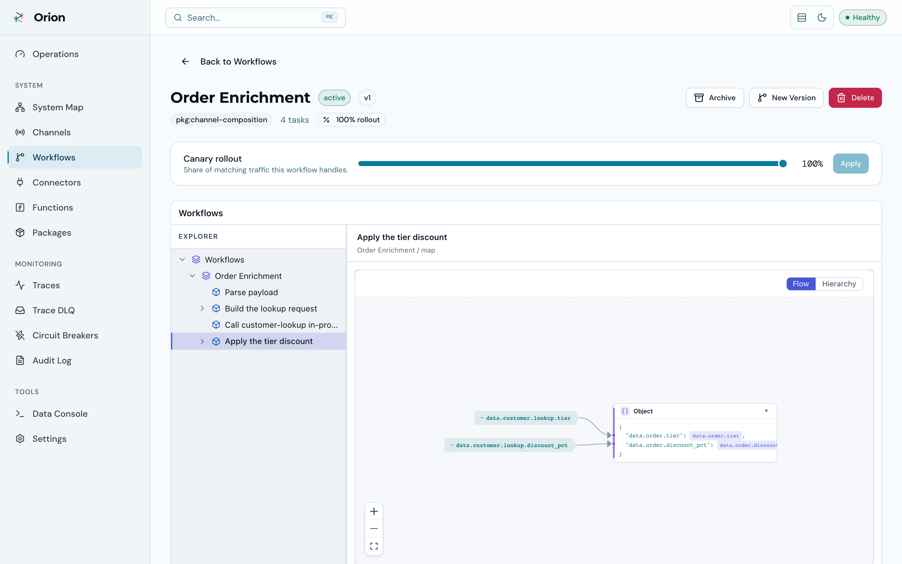
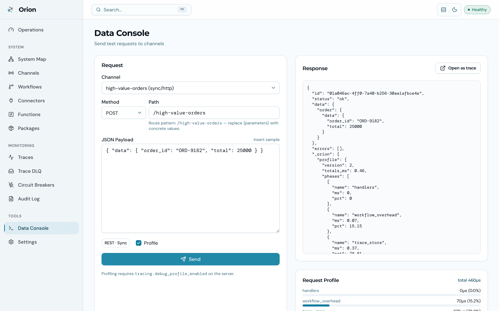

<div align="center">
  

  # Orion UI

  **The operations console for the [Orion](https://github.com/GoPlasmatic/Orion) services runtime.**

  Live dashboards, a system map of your channels and connectors, visual workflow
  authoring, trace drill-downs, and full channel/workflow/connector management — no CLI required.

  [](https://opensource.org/licenses/Apache-2.0)
  [](https://react.dev)
  [](https://www.typescriptlang.org)
  [](https://vite.dev)
</div>

<table>
  <tr>
    <td width="50%" align="center">
      <picture>
        <source media="(prefers-color-scheme: dark)" srcset="media/ui-operations-dark.png">
        
      </picture>
      <em>Operations dashboard</em>
    </td>
    <td width="50%" align="center">
      <picture>
        <source media="(prefers-color-scheme: dark)" srcset="media/ui-system-map-dark.png">
        
      </picture>
      <em>System Map — live traffic across the call graph</em>
    </td>
  </tr>
  <tr>
    <td width="50%" align="center">
      <picture>
        <source media="(prefers-color-scheme: dark)" srcset="media/ui-workflow-dag-dark.png">
        
      </picture>
      <em>Workflow logic, visualized</em>
    </td>
    <td width="50%" align="center">
      <picture>
        <source media="(prefers-color-scheme: dark)" srcset="media/ui-console-dark.png">
        
      </picture>
      <em>Data Console</em>
    </td>
  </tr>
</table>

All screenshots are captured from a live instance seeded with the main repo's
[example packages](https://github.com/GoPlasmatic/Orion/tree/main/examples/packages), following the
[recording pipeline](https://github.com/GoPlasmatic/Orion/tree/main/docs/recordings)
there — whose ~50-second console walkthrough shows this UI taking a service from
nothing to live without writing code.

---

## Quick Start

### Run with Docker (recommended)

The UI ships as a production-ready container image (nginx, multi-arch amd64/arm64):

```bash
docker run -p 8081:8080 \
  -e ORION_URL=http://host.docker.internal:8080 \
  ghcr.io/goplasmatic/orion-ui:latest
```

Open `http://localhost:8081`. `ORION_URL` points at your Orion server; the bundled
nginx reverse-proxies all `/api/` requests to it.

### Run the full stack with Docker Compose

With the [Orion](https://github.com/GoPlasmatic/Orion) repo checked out as a sibling
directory, one command brings up the server and the UI together:

```bash
docker compose --profile prod up    # server + production UI on :8081
docker compose --profile dev up     # server + Vite dev server with HMR on :5173
```

### Run from source

```bash
# 1. Start the Orion backend (if not already running)
brew install GoPlasmatic/tap/orion-server && orion-server

# 2. Install and run the UI
npm install
npm run dev
```

Visit `http://localhost:5173` — the dev server proxies API requests to the backend
(default `http://localhost:8080`, override with `ORION_URL=http://your-backend:8080 npm run dev`).

---

## Features

| Feature | Description |
|---------|-------------|
| **Operations** | Live KPIs at a glance — requests/min, error rate, average and p95 latency, and a "what needs attention" feed |
| **System Map** | Every live channel on one canvas, laid out by role — entry channels, then what they call, tier by tier — with live traffic, health and latency drawn on the nodes and edges; click any channel for its blast radius (1 · 2 · all hops). Level of detail by zoom and collapsible clusters keep 60+ channels readable |
| **Channels** | Full lifecycle management — create, edit, version, activate/archive, bulk import, structured config editor (rate limits with key logic, cache with key logic, dedup, CORS, validation logic, tracing, response cookies, inbound OAuth2 / OIDC sign-in, Kafka transport, cron schedules) |
| **Schedules** | Cron channels as first-class: a structured schedule editor (six-field expression, IANA zone, payload, misfire and concurrency policy), what is scheduled and when it next fires, the durable occurrence ledger with retry, and "Trigger now" |
| **Plugins** | Custom task functions as sandboxed WebAssembly components — upload a manifest and component from the browser, validate, activate with pre-flight, see which workflows depend on it, per-function invocation metrics, and this node's load state |
| **Workflows** | Full authoring — create/edit drafts with a visual JSONLogic condition editor, a steps editor with completion from the function catalogue, lint to the line and a live diagram, server-side validation, dry-run testing, import/export, version compare, and canary rollout controls; visual DAG (tree/flow/graph views) |
| **Connectors** | Create and manage HTTP, database, Kafka, cache, storage, and Elasticsearch connectors — including per-operation gates on db/es (make a connector delete-proof with one toggle) |
| **Circuit Breakers** | Monitor and reset per-connector circuit breakers |
| **Traces** | Execution history (sync, async, Kafka and cron runs) with per-task detail and latency/error analytics |
| **Audit Log** | Who changed what, when — across every admin operation |
| **Data Console** | Send test requests to any channel — including REST-routed channels by method and path — with optional profiling |
| **Health** | The whole `/health` report, component by component, with the admin-only detail — background tasks, plugin loads, the scheduler's own numbers — and what each degraded state means |
| **Backups** | Create and list database backups from Engine (SQLite) |
| **Polish** | Command palette (⌘K, or `?`), `g` + key page shortcuts, light/dark/system themes, times in local or UTC, a collapsible sidebar and a drawer on narrow screens, a first-run checklist, empty states, import wizards, unsaved-changes guard on every form |

## Pages

| Route | Description |
|-------|-------------|
| `/` | Operations dashboard — live KPIs and attention feed |
| `/system-map` | Live traffic map of the channel call graph |
| `/channels`, `/channels/new`, `/channels/:id`, `/channels/:id/edit` | Channel list, creation, detail, editing |
| `/workflows`, `/workflows/new`, `/workflows/:id`, `/workflows/:id/edit` | Workflow list, authoring, visual DAG detail with dry-run and rollout |
| `/plugins`, `/plugins/new`, `/plugins/:id`, `/plugins/:id/edit` | WebAssembly plugin list, upload, detail (manifest, dependants, invocations, load state), editing |
| `/packages` | Promotion receipts (read-only) |
| `/connectors`, `/connectors/new`, `/connectors/:id`, `/connectors/:id/edit` | Connector management |
| `/circuit-breakers` | Circuit breaker status and reset |
| `/traces`, `/traces/:id` | Execution traces and per-task drill-down |
| `/schedules`, `/schedules/occurrences/:id` | Cron schedules, the occurrence ledger, and one occurrence in full |
| `/trace-dlq` | Async dead-letter queue — inspect, requeue, purge |
| `/audit` | Audit log |
| `/console` | Data console for test requests (channel or REST method + path) |
| `/engine` | Health report, engine reload, backups, and API docs (`/settings` redirects here) |

## How It Works

```
┌────────────────────────────────────────────────────────┐
│                       Orion UI                         │
│                                                        │
│  ┌────────────┐  ┌────────────┐  ┌─────────────────┐   │
│  │ Operations │  │ System Map │  │ Channels /      │   │
│  │ Dashboards │  │  Topology  │  │ Workflows /     │   │
│  │  & Traces  │  │   Graph    │  │ Connectors /    │   │
│  │ Schedules  │  │            │  │ Plugins CRUD    │   │
│  └──────┬─────┘  └─────┬──────┘  └────────┬────────┘   │
│         └──────────────┼──────────────────┘            │
│                 TanStack Query                         │
│                 (cache + fetch)                        │
└────────────────────────┼───────────────────────────────┘
                         │  /api/v1/*
                         ▼
                ┌────────────────┐
                │  Orion Server  │
                │  (Rust, :8080) │
                └────────────────┘
```

In production the container serves the built SPA with nginx and reverse-proxies
`/api/`, health, and metrics endpoints to the Orion server (`ORION_URL`).

## Scripts

| Command | Description |
|---------|-------------|
| `npm run dev` | Start dev server with HMR |
| `npm run build` | Type-check with `tsc` then bundle |
| `npm run lint` | Run ESLint |
| `npm run preview` | Serve the production build locally |
| `npm test` | Unit tests, including the API ↔ OpenAPI contract check |
| `npm run test:e2e` | Playwright smoke flow against a live orion-server |
| `npm run generate:api` | Regenerate API types from the vendored OpenAPI spec |

## Project Structure

```
src/
├── api/            # Typed fetch client and per-domain endpoint modules
├── hooks/          # TanStack Query wrappers (one file per domain)
├── pages/          # Route-level page components
├── components/
│   ├── ui/         # Reusable primitives (Button, Card, Badge, Table, …)
│   ├── layout/     # App shell (sidebar, header, command palette)
│   ├── graph/      # Topology and relationship graphs
│   └── traces/     # Trace analytics and detail views
└── lib/            # Utilities, theme and time-zone providers, topology builders
```

## Built With

| Library | Purpose |
|---------|---------|
| [React 19](https://react.dev) | UI framework |
| [React Router 8](https://reactrouter.com) | Client-side routing |
| [TanStack Query](https://tanstack.com/query) | Server state, caching, and mutations |
| [TanStack Table](https://tanstack.com/table) | Headless data tables with sorting and pagination |
| [Tailwind CSS v4](https://tailwindcss.com) | Utility-first styling with CSS variable theming |
| [@goplasmatic/dataflow-ui](https://github.com/GoPlasmatic/dataflow-rs) | Workflow DAG visualization (tree/flow/graph) |
| [@goplasmatic/datalogic-ui](https://github.com/GoPlasmatic/datalogic-rs) | JSONLogic condition editor |
| [Recharts](https://recharts.org) | Trace analytics charts |
| [Lucide React](https://lucide.dev) | Icons |

## Related

- **[Orion](https://github.com/GoPlasmatic/Orion)** — the services runtime this console operates
- **[Orion CLI](https://github.com/GoPlasmatic/Orion-cli)** — terminal + MCP-server companion
- **[Orion Documentation](https://goplasmatic.github.io/Orion/)** — concepts, API reference, tutorials

## Contributing

Contributions are welcome! Please open an issue or submit a pull request on [GitHub](https://github.com/GoPlasmatic/Orion-ui).

```bash
npm install              # Install dependencies
npm run dev              # Development server
npm run build            # Type-check and build
npm run lint             # Lint
```

## License

Apache-2.0 — see [LICENSE](LICENSE) for details.
